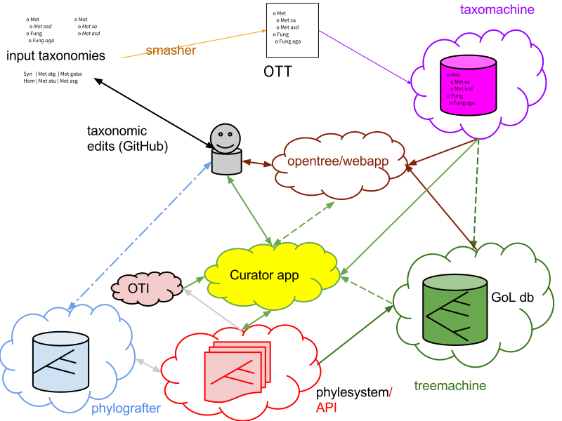

# 

 

by Open Tree of Life developers (primarily Mark T. Holder, Emily Jane McTavish, Duke Leto, and Jim Allman)

**Big Thanks to NSF!**

---
# peyotl

* Python library
1. implements much of the [phylesystem-api](https://github.com/OpenTreeOfLife/phylesystem-api)
1. manages local instances of the [phylesystem](https://github.com/OpenTreeOfLife/phylesystem)
2. call open tree web services for:
    * interacting with the "central" phylesystem-api
    * resolve names to the [Open Tree Taxonomy](https://github.com/OpenTreeOfLife/reference-taxonomy/wiki)
    * query against an estimate of the Tree of Life

---
# Open Tree of Life
* we've adopted a service oriented architecture.
* things have gotten a bit complex...

---

 

---
# Open Tree of Life APIs

* come to the [Tree-for-all hackathon!](https://docs.google.com/document/d/10bjPVPnITJKvIt9ZWsM5-IK7h7H7QooWWwZBLnZ9cEA)
* [https://github.com/OpenTreeOfLife/opentree/wiki/Open-Tree-of-Life-APIs](https://github.com/OpenTreeOfLife/opentree/wiki/Open-Tree-of-Life-APIs)
* note the "v1": `...org/treemachine/`**v1**`/getDraftTree...`

---
# `peyotl` api wrappers

* make accessing the API simpler and more "pythonic"
* improve stability - when the Open Tree of Life API version changes, the `peyotl` interface won't (hopefully)

---
# Taxonomic Name Resolution Service
* calling in "taxomachine" by Cody Hinchliff.

<pre  class="snippet">
from peyotl.sugar import taxomachine
print taxomachine.TNRS('Anolis sagrei')
</pre>
returns a object summarizing the possible matches.

---
# Getting a pruned version of the "full tree"
<pre class="longsnippet">
from peyotl.sugar import treemachine as tm
o = [515698, 515712, 149491, 876340, 505091, 840022, 692350, 451182, 301424, 876348, 515698, 1045579, 267484, 128308, 380453, 678579, 883864, 863991, 3898562, 23821, 673540, 122251, 106729, 1084532, 541659]
r = tm.get_synth_tree_pruned(ott_ids=o)
</pre>

returns the tree (currently only in an odd, in-house format called "Arguson")

---
# Searching the input trees
* calling in "oti" by Cody Hinchliff.

<pre class="snippet">
from peyotl.sugar import oti
n = 'Aponogeoton ulvaceus'
print oti.find_trees(ottTaxonName=n)
</pre>

returns a list of objects listing studyID and treeID

---
# Obtaining an input tree
<pre class="snippet">
from peyotl.api import PhylesystemAPI
pa = PhylesystemAPI(get_from='api')
print pa.get('pg_10',
             tree_id='tree3',
             subtree_id='ingroup',
             format='newick')
</pre>
returns the ingroup of "tree3¨ from study "pg_10" in newick.

---
# 4 routes to an input tree
<pre class="snippet">
pa = PhylesystemAPI(get_from='api',
                    transform='server')
</pre>
<pre class="snippet">
pa = PhylesystemAPI(get_from='api',
                    transform='client')
</pre>
<pre class="snippet">
pa = PhylesystemAPI(get_from='external')
</pre>
<pre class="snippet">
pa = PhylesystemAPI(get_from='local')
</pre>
<pre class="snippet">
t =  pa.get('pg_10',...
</pre>

---
# "api" mode
<pre class="client">
request tree
</pre>
<pre class="server">
look up location of study NexSON file
</pre>
<pre class="server">
read NexSON file
</pre>
<pre class="server">
extract tree
</pre>
<pre class="server">
convert to newick
</pre>
<pre class="server">
return to client
</pre>

---
# "api" + transform=client
<pre class="client">
request tree
</pre>
<pre class="server">
look up location of study NexSON file
</pre>
<pre class="server">
read NexSON file
</pre>
<pre class="server">
return to client
</pre>
<pre class="client">
extract tree
</pre>
<pre class="client">
convert to newick
</pre>

---
# "external" mode
<pre class="client">
request tree
</pre>
<pre class="server">
look up GitHub URL of study NexSON file
</pre>
<pre class="github">
return to study NexSON client
</pre>
<pre class="client">
extract tree
</pre>
<pre class="client">
convert to newick
</pre>

---
# "local" mode
<pre class="client">
request tree
</pre>
<pre class="client">
look up location of study NexSON file
</pre>
<pre class="client">
read NexSON file
</pre>
<pre class="client">
extract tree
</pre>
<pre class="client">
convert to newick
</pre>

---
# "eviscerated web-services"

In the `phylesystem-API`:

* the datastore is publicly accessible as the git repo (Emily Jane McTavish's talk)

* the library (`peyotl`) adding functionality to the data was designed to be a server-side and a client-side library.

---
I'm *hoping* that `peyotl` will be:

1. a useful tool for Python programmers,

2. a easy-to-grok entry point to the intimidating set of services offered by the Open Tree of Life effort.