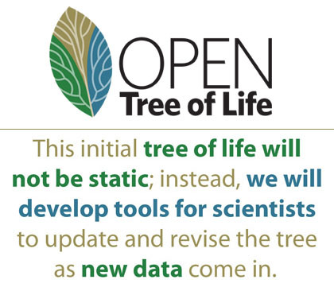

# Using a git-based datastore for community curated phylogenies 
  

Emily Jane McTavish and Mark T. Holder  
University of Kansas  
iEvoBio, June 2014  

.notes: Pressing 2 will display these fascinating notes

.fx: titleslide

# presenter notes
Notes go here
---

# Open Tree of Life

.fx: imageslide whiteheading

---
# Community contributed phylogenies

 - 6745 trees from 2914 published studies
 - 1188 trees from 991 studies partly curated 
 - 335 source trees completely curated

---
# Data store

 - trees and annotations by study in Nexson format
 - Whole datastore is a git repo!  
 

--
#Pros:
 - Tracking curation attribution
 
---
# Curation of phylogenies

 - Non-trivial effort 
 - Taxonomic name recognition services
 - Some subjective choices, edits made by many in the community over time
 
---
# Storing and Sharing

 - These trees are the backend for OpenTree Showpiece,  
## the synthetic tree!
 - but also a useful datastore for otehr phylogeneticists
 - Repo is hosted on GitHub, entire data store can be easily cloned and updated
 
---
# Cons:

 - diffing doesn't always behave well.
simple data structures behave oddly...

Meaningful merges
 -- immutable
 -- can't

Is this model applicable for database store

- Decisions that studies won't move.

- given the study ID what shard will it be in.

- scales better in general.

- Data is so open.

---

# A full-screen image

---

# Rob Allen (Akrabat)

* @akrabat
* http://akrabat.com/
* Zend Framework Education Advisory Board

# Evan Coury (EvanDotPro)

* @EvanDotPro
* http://blog.evan.pro/
* Zend Certified Engineer

#presenter notes

Some notes for the presenter display only

*we can do italics too*

And a list:

* item 1
* item 2
* item 3

Some other line

---

# This is a title

.notes: These are some more notes that are really fascinating and I really want to display them!

This is just a paragraph of text that is quite long so that it probably goes over multiple lines. As such it should still look okay though!

>We shall defend our island, whatever the cost may be, we shall fight on the beaches, we shall fight on the landing grounds, we shall fight in the fields and in the streets, we shall fight in the hills; we shall never surrender.

&mdash; <cite>Winston Churchill</cite>

---

# This is a very long title here to ensure it wraps correctly

This is just a paragraph of text that is quite long so that it probably goes over multiple lines. As such it should still look okay though!

---

# This is a list

* The first item
* The second item with some `preformatted` text
* The third item  
   with a new line

---

# Another slide

This a line of text

## This is a sub-title

1. item 1
2. item 2
3. item 3

---

# Some interesting code here

    !php
    class TheatreController extends AbstractActionController
    {
        protected $theatreMapper;

        public function indexAction()
        {
            $mapper = $this->getTheatreMapper();
            $theatres = $mapper->fetchAll();

            return new ViewModel(array('theatres' => $theatres));
        }

---

# A title with an image

---
# Thank you

