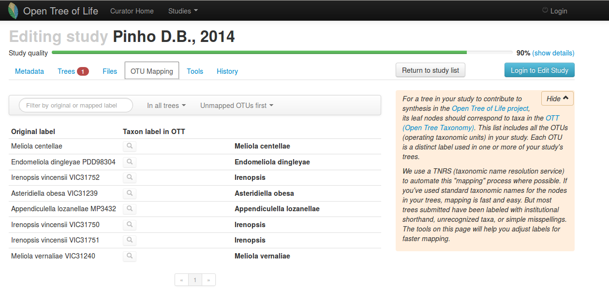
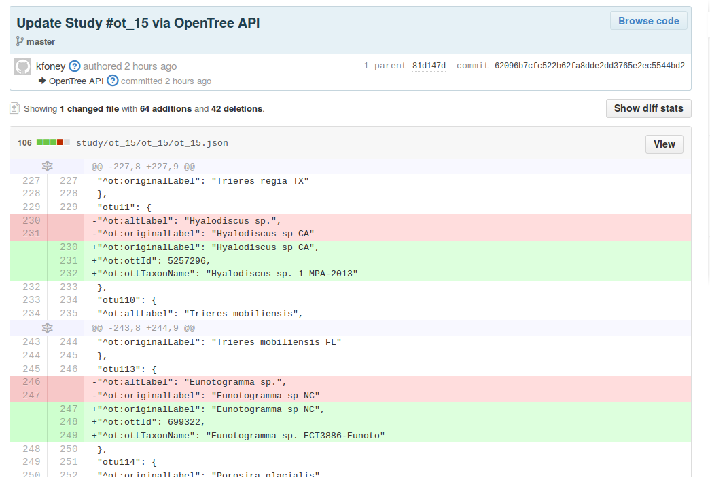

# Using a git-based datastore for community curated phylogenies 
  

Emily Jane McTavish and Mark T. Holder  
University of Kansas  
iEvoBio, June 2014  

.fx: titleslide

# presenter notes
Notes go here

---

# Open Tree of Life

.fx: imageslide whiteheading

---
# The current (as of May) data set
## Community contributed phylogenies

 - 6745 trees from 2914 published studies
 - 1188 trees from 991 studies partly curated 
 - 335 trees from 327 studies completely curated and included in the synthetic tree.

Smith, Cranston et al. *Submitted*

---
# The problem:
 - Large data set: Thousands of phylogenies, and always growing (hopefully!)
 - Each phylogeny requires some hand curation, often by multiple people
 - Need to be readily accessible, and editable by interested researchers
      
 
 

Smith, Cranston et al. *Submitted*

---
# Curation
- Open Tree Curation 
 

---
# Potential options:
 - SQL database
 - Mongo, couchDB
 - git/github

---
# We chose git!

 - Trees and annotations by study in Nexson format  
(JSON serialization of NeXML)
 - Whole datastore is a git repo!  
 
 

---
# Curation
- Work in progress branch is created upon curation  
If study hasn't been edited by someone else, changes are automatically merged.  
Otherwise, merged changes are returned to curator to accept or reject
- Updates pushed to GitHub after each commit

---
# Features
 - Tracking curation attribution  
## Curation of phylogenies
 - Non-trivial effort 
 - Taxonomic name recognition services
 - Some subjective choices, edits made by many in the community over time

---
# Curation
 

 
---
# Features
 - These trees are the backend for OpenTree prize pig  
## the synthetic tree!
 - but also a useful datastore for other researchers
 - Repo is hosted on GitHub, entire data store can be easily cloned and updated
 - Anyone can download all the data!
 
---
# Features
- Hosting on Github  
- Free  
- Familar to  many in the field

---
# Potential issues:
 - Phylogenies are hard to diff - e.g. rerooting changes everything!
 - Nexson are not a line based format
 - Repo size limits on github

---
# In the future:
  
 - Semantic diffs
 - Pull requests
---
# Take a look!

<a href="https://github.com/OpenTreeOfLife/phylesystem-1/"> github.com/OpenTreeOfLife/phylesystem-1 </a>
    
---
# Is a git-based datastore right for your project?
  
 - Maybe! Any of the OpenTree software team are happy to chat about pros and cons.

---
# Thank you
Mark Holder  
University of Kansas
OpenTree of Life project  
Especially the Software team  
NSF AVATOL #1208809  

 

