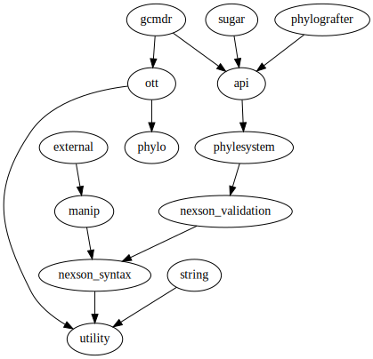
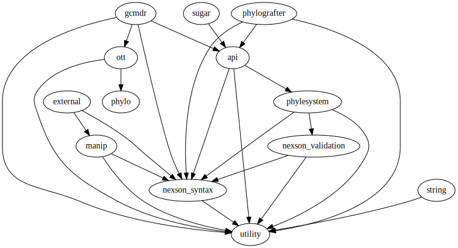
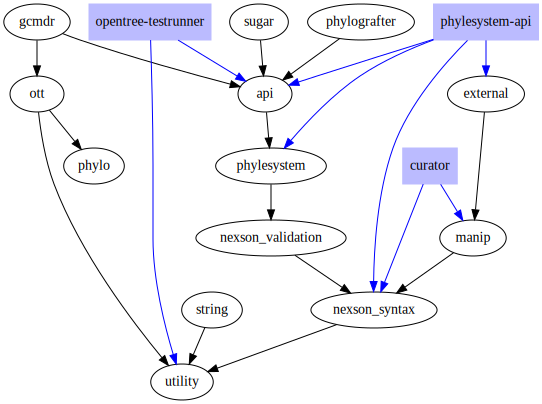

Peyotl can be a bit intimidating because of the large number of subpackages.
However, we do try to keep these packages from being intertangled with
dependencies from any part to any other part.

As you can see from the simplified dependency graph below, there are low-level and high-level
parts of peyotl. From "lowest" to highest their goals are:

Low level:

   * `utility` provides helper functions for common string, and input/output opertions - *no phylogenetics* in here.
   * `phylo` is a nascent package of phylogenetic data structures that are not based on the NexSON data model, but 
        allow more efficient operations. It will not depend on any part of peyotl other than `utility`

Mid-level:

   * `nexson_syntax` provides operations for transforming the various syntactic forms of NexSON
        into each other and into NeXML (which is a purely syntactic operation)
   * `nexson_validation` provides support for validating the content of a NexSON and issuing errors/warnings
        if expected elements are not present
   * `phylesystem` provides support treating a directory containing muliple git repositories (each with a study 
        directory) as database of NexSON file. This performs the backend of the phylesystem-api 
        operations used in open tree.
   * `manip` is currently quite small. It is intended to help you write operations over the data model of
        NexSON. For instance, you can use functions in the subpackage to iterate over each tree in a NexSON.

High level:

   * [`api`](../api-wrappers): wrappers around Open Tree of Life web services
   * `sugar` provides wrappers to make it easier to refer to parts of peyotl as tersely as possible.
   * `ott` routines for reading the
        [OTT taxonomy files](https://github.com/OpenTreeOfLife/reference-taxonomy/wiki/Interim-taxonomy-file-format)
        and performing operations on the taxonomy. Currently just writes caches of smaller slices
        of information to enable limited operations in a more efficient manner

Experimental higher level modules:

   * `external` is intended to handles conversion to external resources (Treebase import is supported now).
   * `string` (may be renamed). It is not currently used, but provides some more
        exotic regular expressions intended to help parse taxonomic names. 
   * `gcmdr` a proof of concept reimplementation of parts of the 
        [gcmdr](https://github.com/OpenTreeOfLife/gcmdr) tool.

Open Tree maintainer modules (probably not of interest to other developers):

   * [`phylografter`] contains code for dealing with synchronizing the phylesystem repositories with 
        phylografter. This was used in the import of the data, but does not yet support continued syncing.
        It is fairly dormant.

## dependency structure
The simplified graph of dependencies is:

The complete graph of dependencies:

The simplified dependency graph with other open tree tools shown in blue is:

### building the graphs
The simplified graph can be produced by running:

    python dev/detect_intra_peyotl_dependencies.py -d -s  > simple.dot
    dot -Tsvg -osimple.svg simple.dot

The full graph is produced by omitting the `-s` flag from the first command above.

The graph with the external tools uses some hacks that rely on you having all
of the open tree repos "sister" to each other on the filesystem. If that is the case
then (from the peyotl directory) you can run:

    bash dev/find_external_peyotl_imports.sh > dev/external_deps.txt

and then using `-edev/external_deps.txt` in the detect_intra_peyotl_dependencies.py script

